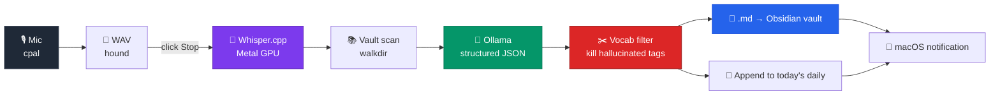

<div align="center">

# `stt-md`

**Record. Transcribe. Summarize. All local. Straight to Obsidian.**

A 3 MB macOS menubar app that turns your meetings into structured Markdown notes — using local Whisper for speech-to-text and a local LLM for summaries — without ever sending audio to the cloud.

[](./LICENSE)
[](https://www.rust-lang.org)
[](https://www.apple.com/macos/)
[](https://developer.apple.com/metal/)
[](#why)
[](#why)

</div>

---

## How it looks

```
┌─ menubar (top-right of macOS) ──────────────────────────────┐
│  ...other icons...   [STT 12:34]   ⏰ 22:47   🔋 87%         │
└───────────────────────────────────────────────────┬─────────┘
                                                    │ click
                                                    ▼
                            ┌─────────────────────────────┐
                            │ ● grabando 12:34            │
                            │ ─────────────────────────── │
                            │ Empezar reunión             │
                            │ Detener — 12:34             │
                            │ ─────────────────────────── │
                            │ Salir                       │
                            └─────────────────────────────┘
```

## Pipeline



## Why

There are great meeting-notes apps already — but most either ship to the cloud, weigh hundreds of megabytes of Electron, or refuse to integrate with the way *you* organize knowledge. `stt-md` is opinionated:

| | Cloud transcribers | [stt-tomi / Meetily](https://github.com/Zackriya-Solutions/meeting-minutes) | **`stt-md`** |
|---|:---:|:---:|:---:|
| Audio leaves your machine | ✅ | ❌ | ❌ |
| Bundle size | ~50–100 MB | ~1.6 GB | **~3 MB** |
| Cold start | varies | 1–2 s | **<500 ms** |
| Backend process | cloud | FastAPI + SQLite | **none (flat files)** |
| UI | Electron / web | Tauri + Next.js | **native AppKit tray** |
| Lines of code | unknown | ~10k+ | **~2k** |
| Output | proprietary | SQLite + JSON | **Markdown into your Obsidian vault** |
| Tag intelligence | none | none | **reuses your existing vault vocabulary** |

The "tag intelligence" piece is the interesting one: most LLM summarizers will happily invent new tags every meeting (`#integration`, `#auth-stuff`, `#team-sync`), polluting your vault with one-off labels. `stt-md` scans your vault first, hands the LLM a closed list of tags you actually use, and *also* filters the LLM's response post-hoc against that list. Hallucinated tags are dropped, not adopted.

## Requirements

- **macOS 11+** on Apple Silicon (uses Metal for Whisper acceleration)
- **[Ollama](https://ollama.ai)** running locally:
  ```bash
  brew install ollama
  ollama pull qwen2.5:7b
  ```
- **A Whisper.cpp GGML model**:
  ```bash
  mkdir -p "$HOME/Library/Application Support/stt-md/models"
  curl -L -o "$HOME/Library/Application Support/stt-md/models/ggml-large-v3-turbo.bin" \
    https://huggingface.co/ggerganov/whisper.cpp/resolve/main/ggml-large-v3-turbo.bin
  ```
- **Rust 1.77+** (only needed to build from source)

## Install

### From source

```bash
git clone https://github.com/dreamxist/stt-md
cd stt-md
make build              # cargo build --release + bundle dist/stt-md.app
open dist/stt-md.app    # macOS will ask for mic permission on first launch
```

### Launch at login

```bash
osascript -e 'tell application "System Events" to make login item at end \
  with properties {path:"/full/path/to/stt-md.app", hidden:true}'
```

To remove later:

```bash
osascript -e 'tell application "System Events" to delete login item "stt-md"'
```

## Configuration

On first launch, `~/Library/Application Support/stt-md/config.toml` is created with sensible defaults:

```toml
vault_root = "/Users/<you>/path/to/your-vault"
ollama_model = "qwen2.5:7b"
ollama_url = "http://localhost:11434"
whisper_language = "es"
whisper_model_filename = "ggml-large-v3-turbo.bin"
```

Edit it to match your setup. The vault is scanned every time you stop a recording, so changes take effect immediately.

## Usage

1. Click `STT` in the menubar → **"Empezar reunión"** (Spanish UI; PRs welcome for translations).
2. Talk. The icon shows `STT 12:34` in real time.
3. Click **"Detener"** → icon switches to `STT …`. Behind the scenes:
   - Audio is downmixed to mono and resampled to 16 kHz.
   - Whisper transcribes in batch with Metal acceleration.
   - The vault is scanned for existing tags and wikilink targets.
   - Ollama is asked for a structured JSON summary, with the existing tag vocabulary inserted into the prompt as a closed list.
   - Hallucinated tags / wikilinks are filtered out post-hoc.
4. A new file lands at `<vault>/2-calendar/YYYY/MM/meetings/YYYY-MM-DD-HHMM-<slug>.md`.
5. A line is appended to today's daily under `## 🤖 Agent Log`.
6. macOS notification: *Reunión guardada*.

Total post-processing time for a 30-minute meeting: ~30–60 seconds on an M3 Pro.

## Output format

<details>
<summary>Click to expand example</summary>

```markdown
---
date: 2026-04-26
day: domingo
time: 14:30
title: HeyMark standup
duration_min: 32
tags: [meeting, ai-draft, heymark]
people: [juan, maria, pancho]
project: "[[heymark]]"
audio: 2026-04-26-1430-heymark-standup.wav
type: meeting
source: stt-md
---

# HeyMark standup

## Resumen
- Juan finished the onboarding base flow
- Pending validation of final copy with María
- Linear integration prioritized for next sprint

## Decisiones
- Migrar tracking de bugs a Linear esta semana

## Action items
- [ ] @juan — Validar textos finales con María
- [ ] @maria — Avisar al cliente sobre cambio de endpoint *(deadline: 2026-05-05)*

## Personas
- [[juan]]
- [[maria]]
- [[pancho]]

## Transcripción
<details>
<summary>Ver transcripción completa</summary>

[00:00] ...
</details>
```

And the day's daily gets:

```markdown
## 🤖 Agent Log

- 14:30 — [[2-calendar/2026/04/meetings/2026-04-26-1430-heymark-standup|HeyMark standup]] (32m) — `stt-md`
```

</details>

## Project layout

```
src/
├── main.rs              # tao event loop + tray + state machine
├── lib.rs               # module re-exports
├── app_state.rs         # enum AppState { Idle, Recording, Processing }
├── config.rs            # TOML config in Application Support
├── paths.rs             # filesystem helpers
├── sounds.rs            # afplay wrappers (Tink / Pop)
├── notifications.rs     # notify-rust for macOS notifications
├── audio_utils.rs       # WAV load + mono + linear resample
├── recording/
│   ├── mic.rs           # cpal stream
│   └── wav_writer.rs    # hound writer on its own thread
├── transcription/
│   └── whisper.rs       # whisper-rs wrapper with initial_prompt
├── llm/
│   ├── ollama.rs        # /api/generate with format=json
│   ├── prompts.rs       # structured-summary prompt with vault vocabulary
│   └── mod.rs           # MeetingSummary + enforce_vocab()
├── vault/
│   ├── scanner.rs       # walkdir → tags + wikilink targets
│   ├── meeting_writer.rs# generate the meeting .md
│   └── daily_appender.rs# append link to ## 🤖 Agent Log
└── bin/
    ├── transcribe-wav.rs # CLI: WAV → bare-transcript .md (no LLM)
    ├── test-summary.rs   # CLI: prompt + Ollama dry run (set STT_MD_VAULT)
    └── test-e2e.rs       # CLI: full pipeline against any vault
```

## CLI helpers

```bash
# Just transcribe a WAV (no Ollama, no vault):
./target/release/transcribe-wav path/to/audio.wav title

# Dry-run the prompt + Ollama against your vault:
STT_MD_VAULT="$HOME/path/to/vault" ./target/release/test-summary

# Full pipeline against any vault directory:
./target/release/test-e2e path/to/audio.wav path/to/vault
```

## Design notes

<details>
<summary>Why no Tauri / Electron / webview</summary>

The whole app is a state machine driving a tray icon and a worker thread. There's no UI to render — the only visual is the menubar icon and a context menu. Pulling in a webview would multiply binary size by ~50× for nothing. `tao` + `tray-icon` from the Tauri team give native AppKit menus directly.
</details>

<details>
<summary>Why batch-at-stop instead of streaming VAD</summary>

The reference implementation ([stt-tomi](https://github.com/Zackriya-Solutions/meeting-minutes)) does proper streaming with Silero VAD and incremental Whisper calls during recording. That's a great choice if you want live captions or to reduce the post-stop delay to near-zero. For my use case — meeting ends, drop file in vault, look at it later — batch was simpler and the 30–60 s post-processing is fine. The `processor.rs` slot in the source tree is reserved for a future port of stt-tomi's streaming pipeline.
</details>

<details>
<summary>Why Ollama + the vocab filter</summary>

The naive approach is "ask the LLM to summarize and include some tags." LLMs cheerfully invent tags every time, so over a year you end up with `#integration`, `#integrations`, `#integraciones`, `#integracion`, `#integration-work` all describing the same thing. The fix has two parts:

1. **Constrain the prompt**: scan the vault, extract every tag that already exists in any frontmatter or `#inline` form, and inject that list into the prompt as a closed vocabulary.
2. **Trust but verify**: after the LLM responds, filter `tags` and `project_wikilink` against the vault one more time. The LLM is treated as untrusted input; the vault is the source of truth.

This is a small piece of code (`MeetingSummary::enforce_vocab` in `src/llm/mod.rs`) but it's what makes the output safe to dump into a long-lived knowledge base.
</details>

## Known limitations

- **Mic only.** No system-audio capture (Zoom/Meet). Use [stt-tomi](https://github.com/Zackriya-Solutions/meeting-minutes) with BlackHole if you need that.
- **Batch at stop**, not streaming.
- **Linear resampling** with no anti-aliasing low-pass. Fine for speech (80–4000 Hz). Swap for `rubato` if you need fidelity.
- **No code signing.** macOS will ask "Open Anyway" once per build. For wider distribution you'd need an Apple Developer ID ($99/year).
- **Spanish-Obsidian opinionated.** Menu labels and the prompt template are in Spanish; the output schema assumes a `2-calendar/YYYY/MM/` daily-note vault. Both are easy to adapt — PRs welcome.

## Roadmap

- [ ] VAD streaming during recording (port stt-tomi's Silero pipeline)
- [ ] Configurable output schema (multilingual labels, alternative folder layouts)
- [ ] Re-process an existing `.md` (re-run the summarizer with a different model)
- [ ] System audio via Core Audio TAP (no BlackHole on macOS 14.4+)
- [ ] Code signing + DMG distribution

## Contributing

PRs welcome — especially for translations, alternative vault layouts, or the Whisper streaming port. Open an issue first if it's a non-trivial change so we can align on direction.

## License

[MIT](./LICENSE) — do whatever you want, no warranty.

## Acknowledgements

- [whisper.cpp](https://github.com/ggerganov/whisper.cpp) — local STT
- [Ollama](https://ollama.ai) — local LLM runtime
- [stt-tomi / Meetily](https://github.com/Zackriya-Solutions/meeting-minutes) — the heavyweight cousin this learned from
- [tao](https://github.com/tauri-apps/tao) + [tray-icon](https://github.com/tauri-apps/tray-icon) — native menubar without a webview
